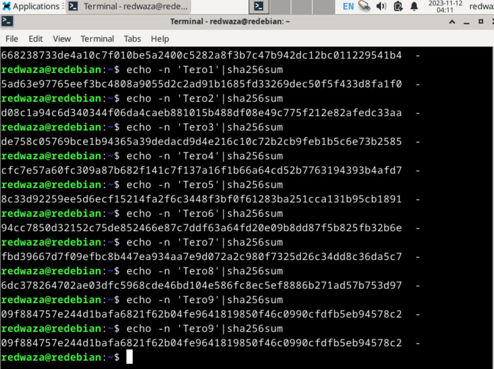

# Summarize

### One-way functions

* functions that are quite easy to compute but can take (with the current computer power) millions of years to reverse.
* due to this one way functions are very useful for encryption purposes, as they are basically impossible to decrypt
* trapdoor one-way function is a type of a one-way function that can also be easily reversed if one knows the secret, otherwise very difficult.

### One-way hash functions
* various names exists for one-way hash functions, such as compression function, contraction function and cryptographic checksum, to name a few.
* central to modern cryptography
* a building block for numerous protocols
* a function that takes a string of variable length (called a pre-image) as an input and computes a fixed-length output string, know as a hash value, which is normally much shorter in length than the input string.
* the idea is to kind of create a fingerprint of the pre-image, which is a value that can be used to describe the likelihood (probability) of any candidate pre-image being equal to the actual pre-image.
* a good one-way hash function is also collision free, meaning that the likelihood is low of generating two pre-images with the same hash value.
* hash function is public, and the secrecy lies in the one-wayness quality of hash functions.
* if you want to verify that for example two files are the same, then instead of comparing the actual files it is just as good to compare their hash values for determining whether they are identical or not. If the hash values are identical then the certainty of the files being identical is very high, basically certain.

### Karvinen 2022: Cracking Passwords with Hashcat

* systems do not store original passwords as strings as this is not safe. Instead, they store hashes, which are basically impossible to convert back to the original password with the currently available computation power to humanity.
* cracking hashes with e.g. hashcat is only as good as having a good and exhaustive dicationary with potential password candidates
* it is important to identify the hash type first, e.g. using hashid.
* hashcat can then be used to try and crack the hash (password) by providing the hash type (e.g. MD2, MD4, MD5, etc.).
* What this tool basically does is it computes the hash value of each word in the provided dictionary given the hash type and then compares the computed hash value to the hash value that we want to crack. If the hash values are the same, the password is cracked.

### Karvinen 2020: Command Line Basics Revisited

* going through various linux commands, such as pwd, ls, cd, less, pipe (|), mkdir
* remote control using ssh
* nano editor for editing files

### a) Billion dollar busywork
After some of trial and error I managed to find a hash value that starts with a zero: `Tero9`. At first I was trying all kinds of random things and then I decided to be systematic and started just putting one number at a time and was going to continue putting one letter at a time, but I found what I was looking for.

```
$ echo -n 'Tero9' | sha256sm
09f884757e244d1bafa6821f62b04fe9641819850f46c0990cfdfb5eb94578c2
```


#### How is this related to Bitcoin?
SHA-256 is the primary hashing algorithm employed in the Bitcoin protocol. Its key role is to implement Bitcoin's Proof-of-Work mechanism. Our previous example is related to Bitcoin in the sense that since hashing is random and quite unpredictable (as noticed even the tiniest change can output an entirely different hash value) so is the mining process in Bitcoin. In Bitcoin mining the miners compete to find a block header hash that meets certain criteria. [How Bitcoin Uses Cryptography]

!!! ADD images from trials

### Compare hash

I created a file called `test.txt` in which I wrote the content 'Hello there!'. After that I printed the hash value (can be seen in the image below). After that I edited the text file and removed the '!' from the end, i.e. the contents were 'Hello there'. The new hash value of the file was completely different. 

PS. I had issues copy/pasting between the linux machine and the machine that I used for writing the report, thus I am using screenshots.

!!! add hello_world_text_file_hash image


The noticed thing (again) is that the hash value is completely different even though only one character was removed.

### Install hashcat and test that it works.
I installed the packages `hashid`, `hashcat` and `wget` as instructed in Cracking Passwords with Hashcat. Using wget I then downloaded the Rockyou dictionary, decompressed and removed the unnecessary compressed file.

!!! add hashcat_installation
!!! add hashid_test_file

For testing the hashcat I decided to hash the word 'Beautiful' using command `echo -n 'Beautiful' | sha256sum`. After that I identified the hash type using hashid and in the end I used hashcat and the Rockyou dictionary to see if it can crack my word. It was cracked.

!!! add hashcat_trial_1
!!! add hashcat_trial_2

### Crack this hash: 21232f297a57a5a743894a0e4a801fc3

Similarly to the previous exercise, I started by identifying the hastype for the hashvalue that we need to crack. The first three hash types identified were MD2, MD5 and MD4. After that I used hashcat along with the Rockyou dictionary to try and crack the password:

```$ hashid -m 21232f297a57a5a743894a0e4a801fc3
   $ hashcat -m 0 '21232f297a57a5a743894a0e4a801fc3' rockyou.txt -o solved
```

The cracked password was 'admin'. The reason that my file shows my previously cracked hash with the word 'Beautiful' is because the hashcat command appends to the file, i.e. does not overwrite previous content.

!!! add crack_the_hash_1
!!! add crack_the_hash_2

### Crack this Windows NTLM hash: f2477a144dff4f216ab81f2ac3e3207d

Using the hashid command `hashid -m f2477a144dff4f216ab81f2ac3e3207d` we determine that hte hashcat mode for the NTLM is 1000 (In the assignment it was given that the this is a windows NTLM hash). Thus, we run next the command `hashcat -m 1000 'f2477a144dff4f216ab81f2ac3e3207d' rockyou.txt -o solved`
which manages to crack the hash to the string 'monkey'.

!!! add crack_windows_hash
!!! crack_windows_hash_cracked

### Try cracking this hash and comment on your hash rate $2y$18$axMtQ4N8j/NQVItQJed9uORfsUK667RAWfycwFMtDBD6zAo1Se2eu

In a similar fashion to before:
`hashid -m $2y$18$axMtQ4N8j/NQVItQJed9uORfsUK667RAWfycwFMtDBD6zAo1Se2eu` returned most likely mode being Blowfish (OpenBSD) which had a hascat mode 3200.

!!! add file hash_mode_3200

Afterwards, I ran `hashcat -m 3200 '$2y$18$axMtQ4N8j/NQVItQJed9uORfsUK667RAWfycwFMtDBD6zAo1Se2eu' rockyou.txt -o solved` which cracked the password to '12345'.

!!! add file hash_mode_3200_cracked

For some reason, in this exercise hascat showed the hash rate to be 0 H/s. As this is not correct, I will report the hash rate value that I obtained from the exercise 'Crack this hash: 21232f297a57a5a743894a0e4a801fc3' which was 1282.5 H/s.

## References

Cracking Passwords with Hashcat. Available at: https://terokarvinen.com/2022/cracking-passwords-with-hashcat/. Accessed 12.11.2023

Schneier, B. 2015: Applied Cryptography: Chapter 2 - Protocol Building Blocks: subchapters "2.3 One-way Fuctions" and "2.4 One-Way Hash Functions".

How Bitcoin Uses Cryptography. Available at: https://river.com/learn/how-bitcoin-uses-cryptography/ Accessed: 12.11.2023
