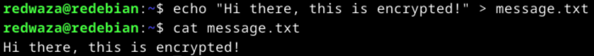

# Summarize

### 2.5 Communications Using Public-Key Cryptography

* Symmetric algorithm is similar to a safe. If you know the key combination to unlock the safe you can put stuff in and take stuff out of the safe. Otherwise you need to crack the safe.
* The paradigm of cryptography was changed in 1976 using public-key cryptography, which uses two different keys - a public key and a private key.
* Computing the private key from the public key is basically impossible with nowadays technology.
* The public key can be used to encrypt a message, but not to decrypt it. Only the private key can be used to decrypt the message.
* The analogy of symmetric algorithm to a safe becomes in the case of public-key cryptography to a mailbox: anyone knowing the public key can drop a mail in the mailbox, but only the person with the key to the mailbox (the private key) can open it and read it (decrypt the message).
* In mathematical terms this public-key cryptography is based on trap-door one-way functions. The encryption part of the process is the easy direction and the decryption is the hard direction. The private key is the trap-door, which enables the message to be easily decrypted.
* In symmetric algorithm, in order for person A to send an encrypted message to person B, person B needs to deliver the secret which person A needs to use to encrypt the message. This needs to be done somehow safely so noone else in between learns the secret.
* In comparison to symmetric algorithm, public-key cryptography is much easier, as the public key is, well, public. Anyone can get access to it to encryot messages, but only the person/people knowing the private key can decrypt the messages.
* The process becomes even easier when the public keys are stored in a publically accessible database, so person A does not need to ask what is person B's public key.
* In the real-world, public-key algorithms are actually used to encrypt keys, not to encrypt message, and therefore, they are not substitutes to symmetric algorithms. This is due to 1) public-key algorithms being very slow compared to symmetric algorithms and 2) encryptions done using public-key cryptosystems are susceptible to chosen plaintext attacks (I.e. determinging the message based on trial and error using the public key, this is similar to the previously done cracking exercises done with hash values and a dictionary of commonly used passwords).
* The most practical usage of public-key cryptography is to secure and distribute session keys, which are then used together with symmetric algorithms to secure message transfers. The combination of these two processes is called a hybrid cryptosystem.
* The hybrid cryptosystem process solves an important management problem. If only symmetric algorithm is used, the secret used for encrypting/decrypting messages would most likely be used multiple times over many different communication sessions, as safely distributing this secret to other parties is a difficult process. On the other hand, using a hybrid cryptosystem allows for the safe and easy distribution of the information needed to create a secret that all parties use to encrypt and decrypt their messages. Because this is safe and easy, each time two parties wish to communicate with each other, a new secret can be create for each session. This drastically decreases the risk of the secret being compromised.

### 2.6 Digital Signatures

* Signatures have been used for a long time to prove the authorship.
* However, despite the listed compelling parts of signatures by Schneier 2015, such as signatured being authentic, unforgeable, not reusable, etc., in reality these are not 100% true.
* digital signatures have even more problems than traditional signatures, as computer files are easy to copy, cut and paste from one file to another, without leaving a trace.
* One way to sign documents is to use symmetric cryptosystems and an arbitrator. A trusted artbitrator (Trent) can give two parties, say Alice and Bob, two different secret keys Ka and Kb, respectively, which can then be used to sign the messages. After that, for example, Alice can sign her message with Ka and send it to Trent, who then decrypts the message with Ka, encrypts it again with Kb and sends it to Bob. Bob can then decrypt the message with Kb. This process obviously has a flaw in that Trent can read the message that Alice meant for Bob alone.
* A better way to sign documents is using public-key cryptography, in which Alice would sign a document using her private key. After that she would send the document to Bob, who can decrypt the document using Alice's public key. This removes the need for a third trusted party Trent altogether.
* An issue, however, occurs if ther eare no timestamps, as for example a check signed by Alice and send to Bob can be reused multiple times. Therefore, timestamps should be included in the message to prevent this from being possible.
* Signing documents with public-key cryptography is, however, inefficient and relatively slow. Thus, to save time, it is even better to use one-way hash functions for digital signatures, in which the hash of the document is signed instead of the document itself.
* Muliple signatures can be done well with one-way hash functions by each part signing the hash of the document, then one person gathering the signatures of all others involved and sending them along with her own signature and the signed document to the person that needs to verify the signatures.

### 2.7 Digital Signatures with Encryption
* Combining the processes of signing digital documents using public-key cryptography it is possible to achieve both the security provided by encryption and the authenticity provided by digital signatures.
* Signing before encrypting a document is more secure.
* The process can be improved if confirmation messages are returned as a receipt.
* The best way to get someone's public key is via a secure database that stores public keys.
* Substitution of public keys is possible during transmission. To prevent this, each public key can be signed with the trusted arbitrator's private key, which is known as Key Certification Authority or Key Distribution Center (KDC).


### 2.8 Random And Pseudo-Random-Sequence Generation
* Most random-number generators are not that secure to be used for cryptography and not even that random, because computers are finite-state machines.
* In cryptography, however, the random-number generator needs to be really good in producing random numbers, otherwise weird correlations start to occur, which simply should not happen in cryptography. Anything that has correlations gives a possibility to predict and guess.
* Computers can produce pseudo-random sequences, i.e. a sequence that looks random, however, if one zooms out enough periodicity can be noticed.
* Determining this periodicity can be used to attack the system.
* In order for a sequence to classify as a cryptographically secure pseudo-random sequence, it needs to be unpredictable, i.e. it must be computationally infeasible to predict the next random bit.
* a sequence generator is real random if the sequence it produces cannot be reliable reproduced.


### PGP - Send Encrypted and Signed Message - gpg
* The article demonstrates how to use 'gpg' tool for PGP encryption.
* Furthermore, the article describes the steps to simulate an encrypted communication between two parties and how each party can verify that the messages come from a trusted party.

### a) Explain how you have used public key cryptography today or yesterday

One way that I used public key cryptography today is by opening my private banking services in the browser. The bank site secures the communication using HTTPS. The way this works is that when I navigate to the bank site the site shares its public key with my browser, but keeps its private key to itself. Any communication starting from that point onwards between my browser and the bank site is secure. My browser uses the provided public key to encrypt all the communication that it sends to the bank site server (for example sending my login credentials when I logged in). The bank site server then uses its private key to decrypt the received information. Therefore, anyone that may be listening to the messages send between my browser and the bank site server would need the server's private key in order to be able to decrypt the messages that my browser has sent.

### b) Messaging. Send an encrypted and signed message using PGP, then verify and decrypt it.

As a first step we install the needed software:

```
$ sudo apt-get update
$ sudo apt-get install gpg micro psmisc
```

Then we create a keypair:

```
$ gpg --gen-key
```
!!! TODO: add gpg.png

For that we provide some dummy name and email. Next we export the public key using:

```
$ gpg --export --armor --output redwaza.pub
```


After that we create a directory for alince using `mkdir alice/` and we change the permissions for the directory using `chmod og-rwc alice/`. Then we create a public key pair for Alice using `gpg --homedir . --gen-key`.

The next step then is to copy redwaza's public key into alice's directory (`cp -v redwaza.pub alice/`) and to then import redwaza's public key for alice using `$ gpg --homedir . --import redwaza.pub`. We then get the public key id for redwaza using `gpg --homedir . --fingerprint`:


Once this is done, alice needs to sign redwaza's public key in order to trust it. For that we use the obtained public key id: `gpg --homedir . --sign-key "BFE1 B413 AF65 B9F8 92FB D6CC 82AE 2E81 62A9 12AC"`. We verify then that alice trusts redwaza's public key:


We follow the same process for redwaza to trust alice's public key (the steps are skipped here as they are exactly the same). In the end we check that redwaza trusts alice. At this point the trust has been established between the two parties.


Afterwards we create the message that Alice wants to send and sign the message using redwaza's public key (i.e. specifying the recipient demo@example.com):

```
$ nano message.txt
$ gpg --homedir . --encrypt --recipient demo@example.com --sign --output encrypted.pgp --armor message.txt
```

Here is the result:


At this point only redwaza can decrypt this message, as redwaza's private key is needed for the decryption and alice does not have it. The next step is to transfer the encrypted message to redwaza (simulate by simply copying it there) and to decrypt it. This is done the following way:

```
$ cd
$ gpg --decrypt encrypted.pgp
```

and here is the result:


In a similar fashion to the PGP tool we simulated the use of openssl to encrypt a message. In this, we used only one pair of private and public key, however, in reality when there are multiple parties present and they want to communicate with encrypted messages between each other they will have each their own private and public keys. Encrypting the message will happen with the other party's public key after which only that other party will be able to decrypt the message with its private key (and vice versa).

### c) Other tool. (updated 28.11.23)

We will now use another tool (openssl) to encrypt a message. As a first step we will create a pair of private and public keys using the commands `openssl genpkey -algorithm RSA -out private_key.pem` and `openssl pkey -in private_key.pem -pubout -out public_key.pem`. The resulted public_key.pem file is printed out below:


The next step is to create a plaintext message that we are going to encrypt



and then encrypt it. We do this using command `openssl pkeyutl -encrypt -pubin -inkey public_key.pem -in message.txt -out message_encrypted.txt` which uses our generated public key to encrypt the message.


### d) Eve and Mallory.
PGP protects against eavesdropping (Eve) by allowing to encrypt the messages before transfer from person A to person B. Person A can use person B's public key to encrypt the message which is then only decryptable by person B using person B's private key. This can be seen in the command below. The flag `--encrypt` tells pgp to ecnrypt the message and the flag `--recipient demo@example.com` tells pgp who the recipient is and to use the public key for the recipient which is found in the trusted keyring.

```
$ gpg --homedir . --encrypt --recipient demo@example.com --sign --output encrypted.pgp --armor message.txt
```

PGP protects against Mallory (i.e. against mallicious modifications of the messages) by providing the possibility to sign the message. In the command above this happens with the `--sign` flag. This uses the private key of the person signing the message, which can then be verified by the receiving party using the public key of the party that has signed the message. If the message was modified by Mallory, then the received signature would no longer match and it would be possible to tell that the message was modified during trasfer.

### f) Password management.
As I use Apple devices, I widely use the password manager that comes built-in as part of the macOS. In the following example, I show my saved account password for app.terokarvinen.com, which is the place where we return the homework to the course.


Some types of attacks that come to mind that can be used against people not using password manager are:

* As people not using password managers tend to reuse their passwords over and over, an attacker that manages to get their hands on the password of one account can attempt the same password for other accounts and gain access to them as well.
* It may be also so that the user does not completely reuse the same password but changes for example the last letter or digit of their password, i.e. the passwords are not really unique. Similarly to the previous point, knowing one password can be fairly easily used to determine the others. 
* Not using a password managers means that you need to remember your passwords. Therefore, in addition to the previous thought of reusage, these passwords also tend to be weak and simple to remember. This allows attackers to conduct pure brute-force attacks in which they try to guess the password. On the other hand, if the password is difficult to remember people tend to write them down (I have even seen people having their passwords written down on a sticker under their keyboard..)

### g) Refer to sources.
Done


## References


Schneier, B. 2015: Applied Cryptography: Chapter 2 - Protocol Building Blocks: subchapters "2.5 Communications Using Public-Key Cryptography", "2.6 Digital Signatures", "2.7 Digital Signatures With Encryption", "2.8 Random And Pseudo-Random-Sequence Generation".

Trust to Blockchain 2023 autumn. Available at: https://terokarvinen.com/2023/trust-to-blockchain/ Accessed: 20.11.2023
