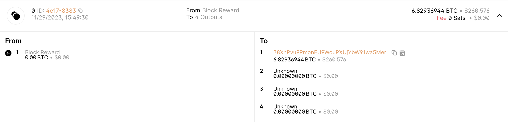
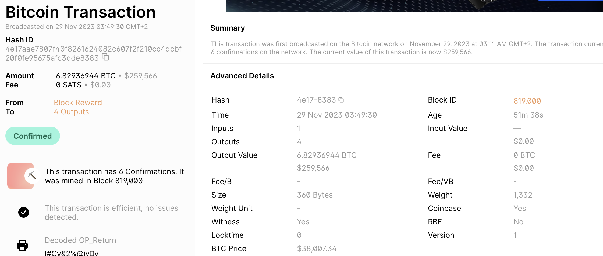

# Summarize

## Bitcoin: A Peer-to-Peer Electronic Cash System

### Introduction
* Online commerce heavily reliable on financial institutions to process electronic transactions, i.e. a trustable third-party.
* Possibility to replace the need for a trusted third party by using cryptographic proof, therefore enabling any two parties to make transactions directly between each other.
* Sellers would be protected from fraud by the system having transactions that are computationally impossibly to reverse with current technology.
* Buyers would be protected by routine escrow mechanisms
* Double-spending problem could be solved by using peer-to-peer timestamps server
* Security of the system relies on honest nodes controlling the majority of the CPU power.

### Transactions
* an electronic coin is a chain of digital signatures
* a transaction between two parties is made by the party who currently owns the coin digitally signing the hash of the previous transaction as well as the public key of the next party to own the coin, after which these are edded to the end of the block.
* Double-spending could be prevented by using a trusted third party, e.g. a bank, but this kills the whole point. Preventing double-spending is achieved using a publicly available transaction "history" and having all participants agree on a single history being the "master". In other words the majority of nodes must agree with a single true history.

### Timestamp server
* The proposed solution to double-spending is using a timestamp server.
* The timestamp server takes a hash of a block of items to be timestamped and then publishes the hash.
* As each timestamps includes the previous timestamps in its hash, this reinforces the previous timestamps.

### Proof-of-Work
* The proof-of-work searches for a value, whose hash has a specified number of zero bits.
* A nonce is incremented to the block until a value is found to match the required zero bits in the hash of the block.
* When each new block gets added to the chain, modifying the previous blocks would require redoing all blocks between it and the current block.
* The longest block chain is also represented by the majority of nodes and has the greatest proof-of-work.

### Network

* The operational sequence for running the network is outlined below:
    1) Broadcasting new transactions to all nodes.
    2) Accumulating new transactions into a block by each node.
    3) Engaging in the process of identifying a challenging proof-of-work for the respective block by each node.
    4) Disseminating the block to all nodes once a node successfully discovers a proof-of-work.
    5) Validating the block acceptance criteria by nodes, considering the validity of all transactions and ensuring they are not already spent.
    6) Demonstrating acknowledgment and acceptance of the block by nodes through the collaborative effort of generating the next block in the chain, utilizing the hash of the accepted block as the preceding hash
* The longest chain is at all times considered as the correct chain
* If mutiple chains exist of similar length, the nodes will work on the first one they received but keep the others in case they became longer, at which point they will switch to them.

### Incentive
* The first transaction of a block is a special one as it creates a new coin owned by the creator of the block. This acts as an incentive to support the network and to add coins into circulation.
* Incentive could transition to being entirely transaction fee based, which is especially good when a predetermined number of coins are in circulation.
* Playing by the rules should provide higher incentive than breaking them.

### Wallet. Create a BitCoin testnet wallet.

As a first step we will run `sudo apt-get update` in order to update the package index files on our system. After that we will install electrum bitcoin wallet by running the command `sudo apt-get install electrum`.

Once the electrum package is installed we can start using electrum by running the following command (NOTE! the use of -testnet): `electrum --testnet`. This command opens the electrum install wizard. We choose option 'Auto connect' and click Next. After that we provide the name for our wallet: 'RedWallet' and click Next. We choose a standard wallet from the next step, create a new seed. This generates a wallet seed that is represented by 12 random words. These need to be saved as having these words allows you to recover the entire wallet. In the next step we are asked to confirm the seed, so we type the previously given 12 words and click Next. In the next step we need to provide a password and confirm it. This password is used to encrypt the wallet keys. In the end we are asked if we want to enable automatic update check, and are showed a warning that testnet mode is being used (not real bitcoins). The following screenshots show some of the steps in the installation process, as well as the running program in the end with our bitcoin wallet ready for action.

### Faucet. Get worthless fake money from a testnet Bitcoin faucet
For this step we google 'bitcoin testnet faucet' and a site is found that can send us fake bitcoins. One such site is `https://coinfaucet.eu/en/btc-testnet/`. The next step is to get one of our addresses shown in our electrum bitoin wallet and copy this address to the field asking for an address to send the fake bitcoins to. After all the 'Verify you are not a robot' checks are done, we successfully received 0.01484738 fake bitcoins. At this stage a total of 6 confirmations are required by peers to validate the transaction and before these confirmations are ready the fake bitcoins cannot be sent onwards. 

### Giveway. Move money to another Bitcoin wallet. Choose an amount where the last two digists are 42.

For the purpose of this exercise we will move 1.42mBTC to wallet address `tb1q6dlta43hxj0tsp9m2l8ayr0fuwlhgnaedue4pz`, which is Tero's wallet address from the previous lecture. Before it is possible to do the transfer, we need to wait for the 6 confirmations of our fake bitcoins.

Now that our bitcoins are confirmed we can initiate the sending process. As instructed we chose an amount ending with last two digits 42, for example 1.42mBTC, keep the fee rate as it is and press Send.

We get a notification that the bitcoins were sent.

Initially, the status is unconfirmed, which similar to the receiving process changes to confirmed once there are enough confirmations.

### Explorer. Use a block explorer to analyze a block on the real Bitcoin blockchain

For the purpose of this exercise the block chain explorer found here will be used: https://www.blockchain.com/explorer. We will analyze the latest block at the time of writing this article, which is block id 819,000, and the first transaction of this block with id '4e17aae7807f40f8261624082c607f2f210cc4dcbf20f0fe95675afc3dde8383'. 

From the block details we are able to see all kinds of information about the block, such as the hash value of the block, the total number of bitcoins that the block is worth, what the value of the block is in terms of US dollars, the number of transactions in the block, fees, the number of nonce's in the block which plays an important role in the proof-of-work, the hash value of the merkle root, the number of bits (representing the minining difficulty), the name of the miner, the number of total confirmations for the block, the mining date and mining reward. (Rees, 2022)

We will now look at the transaction information for the first transaction in this block.

The transaction id is shown '4e17aae7807f40f8261624082c607f2f210cc4dcbf20f0fe95675afc3dde8383', as well as the sender being 'Block Reward' and the receiver being 4 different accounts, of which three are shown as unknown. This transaction shows the reward for mining the block and we can see that an amount of 6.82936944 BTC, equivalent to $260,576, was paid to hash address '38XnPvu9PmonFU9WouPXUjYbW91wa5MerL'. We can also see that the transaction fee was 0.

It is also possible to get a more detailed view of the transaction, which shows additionally the time of the transaction, the total number of inputs and outputs, the size of the transaction in bytes, the block number to which the transaction belongs to, how old the transaction is, as well as the weight of the transaction as compared to the maximum size of the block. (LearnCrypto, 2023)

## References

Nakamoto 2008: Bitcoin: A Peer-to-Peer Electronic Cash System

Rees, K. 2022. What Data Does the Bitcoin Blockchain Store? Available at: https://www.makeuseof.com/what-data-stored-bitcoin-blockchain/ Accessed: 29.11.2023

LearnCrypto. 2023. Exploring Transactions. Available at: https://learncrypto.com/knowledge-base/how-to-use-crypto/exploring-crypto-transactions Accessed: 29.11.2023
