# Iceberg

## Read and summararize

### Shavers & Bair 2016: Hiding Behind the Keyboard: The Tor Browser; subchapters "Introduction", "History and Intended Use of The Onion Router", "How The Onion Router Works", "Tracking Criminals Using TOR".

* The Onion Router (TOR) browser has had quite an impact on anonymous internet browsing
* TOR is modified from firefox to hide user's IP which makes it nearly impossible to track and identify the user
* TOR's purpose is "to allow unfettered and anonymous communication over the internet." (Shavers & Bair, 2016)
* Just the same way that TOR provides anonymity for "normal users" it can be used for illegal activities.
* TOR was developed in 2002 by US government, but no longer controlled by them.
* The Tor browser presents a unique challenge for forensic analysis due to its distinct purpose and design, prompting a reassessment of potential overlooked evidence.
* TOR works by directing a user's internet traffic through random nodes, also called relays.
* Before being transferred to the first node, the data is  encrypted into multiple layers. Then each relay peels off one layer of encryption before passing the result to the next relay. In the end the exit layer connects the user to the requested location. Hence the name of "The Onion Router" (each relay peels off one layer of the onion).
* Each time the user makes a request the entry, middle and exit relays are chosen at random.
* The exit node is the node that can be traced. This sounds like a dangerous business, as any illegal activity could point to anyone relaing the connections.. Sometimes questions are not asked..
* TOR network run by volunteers.
* About each 10 minutes the TOR client changes the entry node.
* TOR installation and uses requires very little technical skills
* TOR is widely used for illegal activities as well due to providing anonymity all kinds of users.
* tracking criminals using TOR has been done in the past, though rarely and due to errors made by suspects, not due to breaking TOR itself
* Exploiting vulnerabilities of the base browser behind TOR, i.e. Firefox, has also been doneby the FBI to catch criminals. This was however patched later.
* The best thing for the end user is to not change any of the default settings of the TOR browser in order to not "accidentally" compromise own privacy. E.g. never allow location tracking, keep javascript disabled, do not install plugins.
* Some methods to "break TOR" and to correlate traffic and identify users is to control as many entry and exit nodes as possible, and interjecting a capture service between the end user and his destination.
* The goal of most internet-related investigations is to find the true IP address.
* One method to obtain the IP address is placing a tracking document that needs to be opened outside the TOR browser (hence outside the "secure perimeter") which then sends the user's IP when opened.
* Using TOR from a corporate network can leave traces that can be used to deduce the user who accessed the TOR network (e.g. based on the time of access and the internet traffic at the time from the users computer.)
* Overall, as mentioned earlier, the most general way to determine the identify of a person using TOR is through their own mistakes.

### 7 Things You Should Know About Tor

* NSA unable to circumvent the anonymity of TOR at the cryptographic level, identifying users has been possible in certain situations only, such as using exploits in the Tor Browser Bundle or user misconfiguration of the browser.
* TOR is used also by people not meaning any harm or having illegal acitivities in mind. Using TOR does not help criminals anymore than using the normal Internet.
* TOR doesn't have a backdoor even though it was developed by the US Navy.
* Running a TOR relay is not illegal (in most countries)
* TOR is fairly simple to use and does not require any more technical skills than normal browser usage (use the default settings)
* TOR is slower than normal internet connection but not that slow
* It is possible to misconfigure TOR so that it reveals your anonymity

## Install TOR browser

For the first step of installing the TOR browser I googled TOR and opened the page https://www.torproject.org. From there I navigated to the download page and selected the 'Download for Linux' option, which downloaded the TOR browser in my Downloads folder.

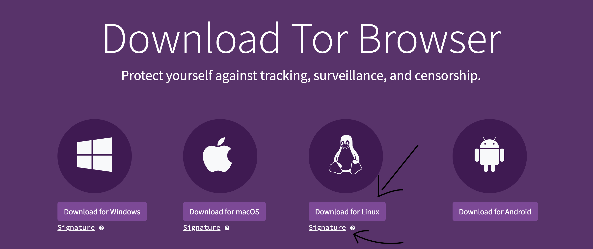

 Once the download was complete I opened the unix shell and navigated to the Downloads directory using `cd ~/Downloads/` command. I decompressed the downloaded tar.xz file using `tar -xf` command as shown below, which created a `tar-browser` directory, inside of which was the 'start-tor-browser.desktop' application.

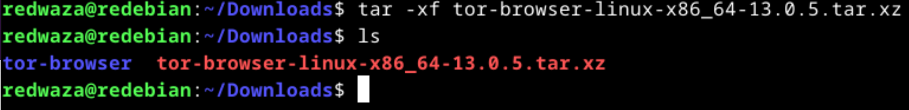

After that I ran the tor browser using the command `./start-tor-browser.desktop`

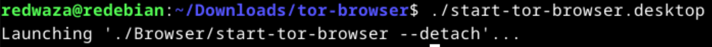

Once the graphical window opened I clicked the 'Connect' button which started establishing the connection to the TOR network.

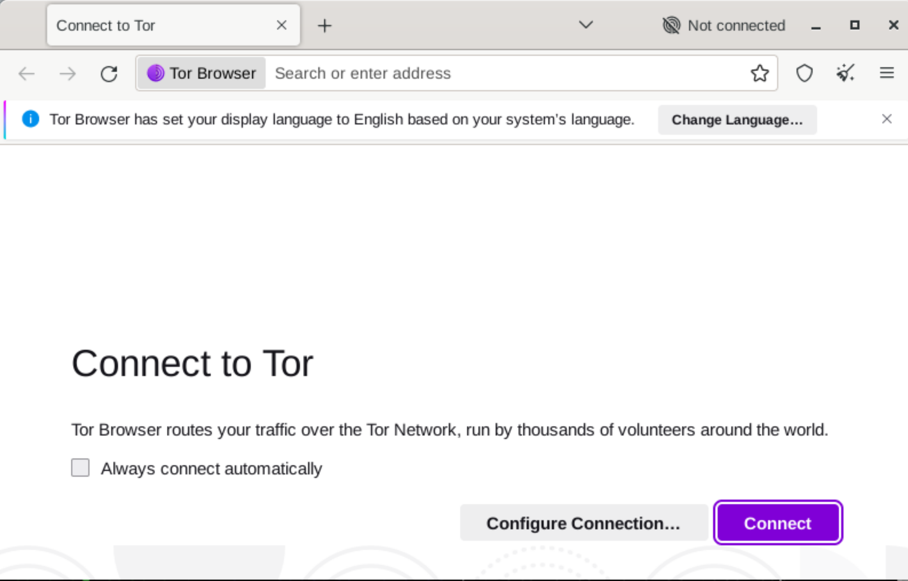
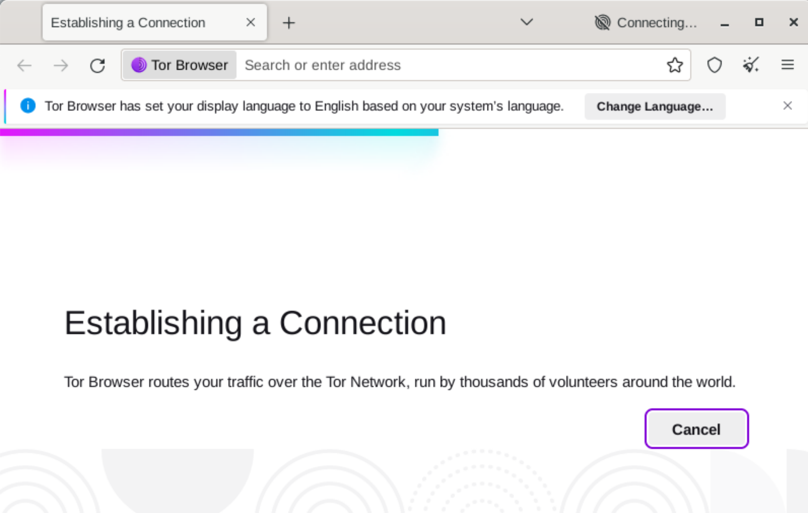

After a short period of time the connection to the TOR network was established and we were ready to start surfing anonymously.

## Browse the TOR network

Now that we have TOR installed and are connected to the TOR network, it is time to start browsing. After toggling the 'Onionize' radio button we search the network for 'iltalehti'.

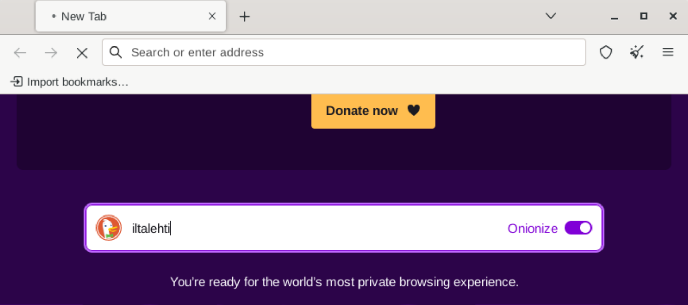

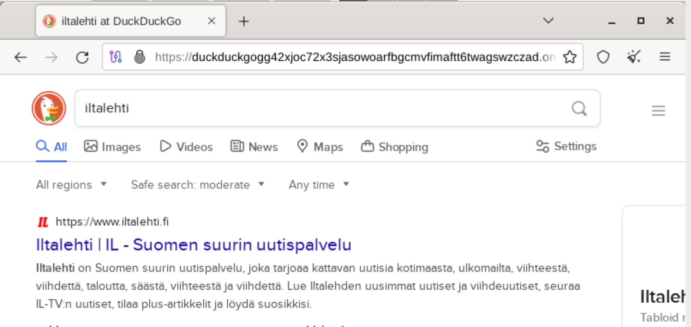

As we can see, the link to the site starts with `https://duckduckgogg42` and ends in the end with `.onion` and all the search queries come still behind. (I cannot copy the exact link from my linux machine). This onion address is a hash value that is based on someones public key. The onion addresses unlike 'normal' websites that majority of people use are not listed in the public DNS record list. (Murtaza, 2022)

First we search the TOR network for 'search engine for onion sites'.

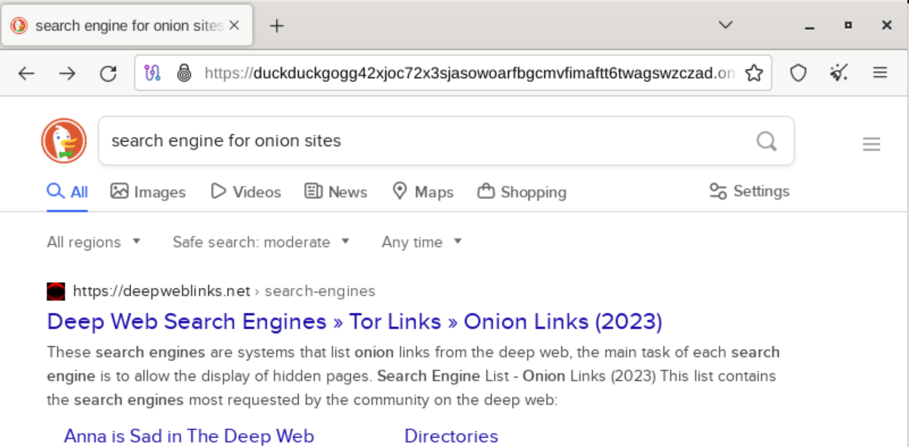

The links that are revealed from the first site include the `https://duckduckgogg42...` that we are currently using as it can be seen from the url bar of the previous screenshot. Some other search engines for onion sites are ahmia.fi (juhanurmi) and Torch. It is worth pointing out that the last two are `http` and not `https` as the one that we are currently using.

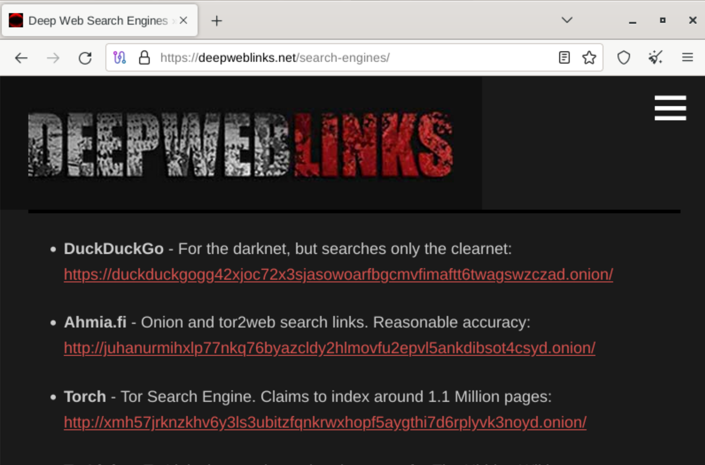

Next we search for 'marketplace', which brings up facebook marketplace as a first hit and also other sites that one would normally get by googling the same thing on the normal web. I searched a bit more and found a place called abacus market which is apparently a darknet market for selling items that are not necessarily "legal".

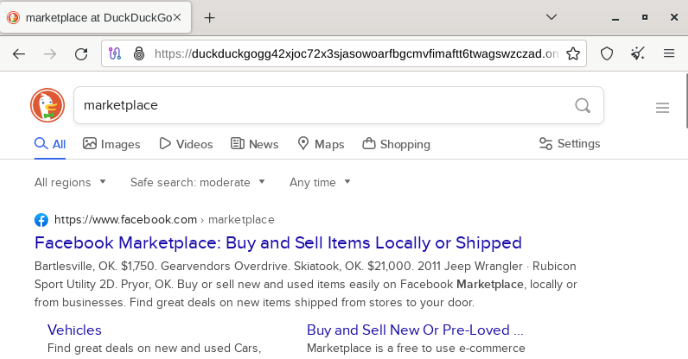

Next we search for 'fraud', which brings up a definition of the word fraud. Scrolling down there are again pretty normal looking sites, such as wikipedia, investopedia, etc.

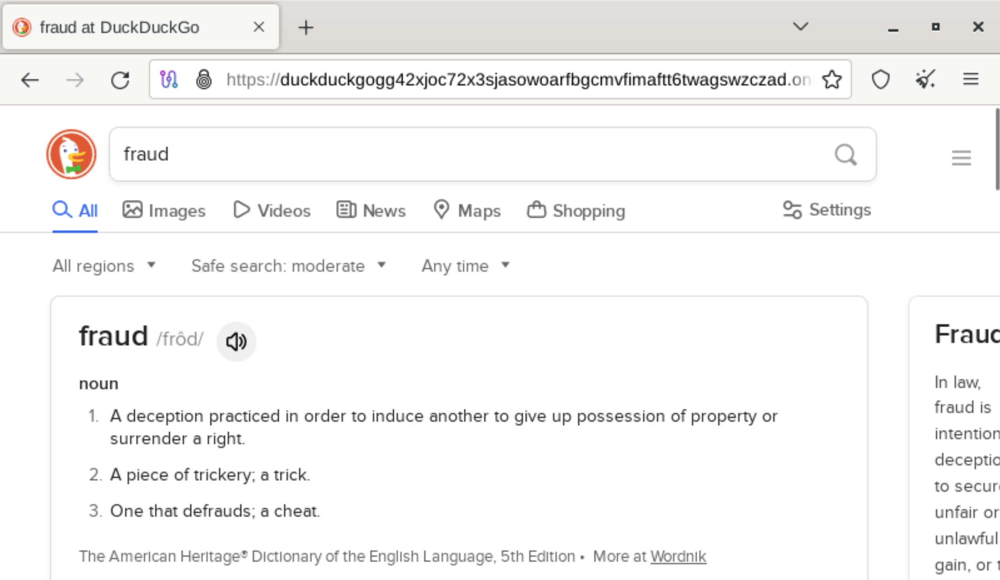

Next we search for a forum and end up opening 'quora'-site, which asks for a login. Not proceeding with login nor creating an account.

In the end we search for a well-known company, such as Apple.

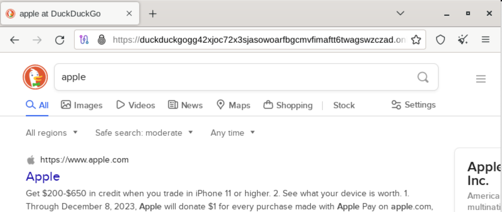
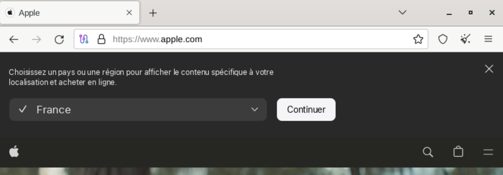

Overall, the experience of searching for various things in the TOR network shows that search is quite slow, as compared to the normal web. This is most likely because the searches go through so many relay nodes (may be located in many different countries) in the TOR network in order to provide privacy for the end user. Another thing that was noticed is how websites do not know your location (where you are), nor anything else about you. Cookies and all other types of tracking activities are disabled in the TOR browser and TOR network, leaving the 'end' sites completely in the dark. In any case the search via the shown `https://duckduckgogg42...` brings pretty normal results. I decided to check in the end ahmia.fi and search through there and noticed completely different results. For example, searching for marketplace in ahmia.fi returned results that I was expecting to see in the first place (some darknet marketplaces, such as Venus marketplace).

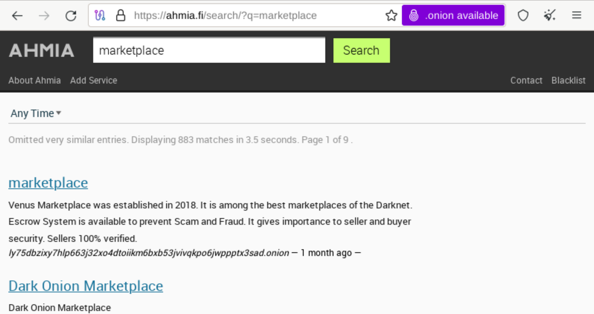

I also searched for forum from ahmia.fi and attempted to open a Cactus Forum, which was not accessible. The TOR client could not find the onionsite.

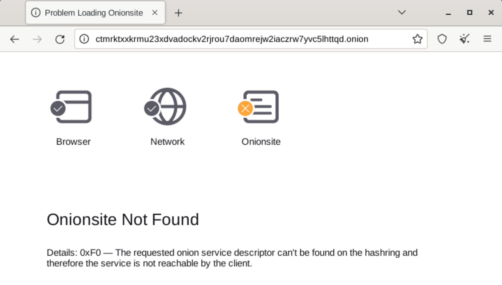

## In your own words, how does anonymity work in TOR?

TOR employs a multi-layered approach to provide anonymity for users. The TOR network consists of many volunteer servers/nodes that upon a request from a user start relaying the network traffic between each other and as the data is routed between nodes, each node peels off one layer of encryption (thus the onion analogy) for the next node. This happens until an exit node is reached that peels off the final layer and passes the unencrypted message to the receiver. This is called onion routing and makes it virtually impossible to determine where the request orginated from. Only the entry node knows where a request orignated from (the IP address of the originating node), and only the exit node knows the IP address of the destination. All the intermediate nodes know only the previous and the next nodes addresses.

Each connection between TOR nodes is encrypted to ensure that the data is secure as it traverses the TOR network. Public keys are used for the end-to-end encryption between the user making the request and the destination. Furthermore, each relay in the TOR network has a public decryption key, known as the onion key, which is used to prove the TOR client that the node is indeed a part of the intended path. This is used to prevent spoofing.  (TOR project, nd.)

## What kind of the threat models could TOR fit? 
TOR's main objective is to provide anonymity and privacy to its users and to defend users against tracking and surveillance. As it displayed on the TOR project's main page: "Browse Privately. Explore Freely". (TOR project, no date) Some threats that come to mind that TOR is particularly well-suited to mitigate are:

1) Surveillance and monitoring
*  Governments and other entities continuously monitor and surveil users' internet activities. TOR can be used to protect users' privacy and anonymity.
2) Identity protection
* More and more individuals nowaday are concerned about revealing their identity or location while browsing the internet. TOR makes it possible to browse privately without revealing IP addresses and location.
3) Network interception and eavesdropping
* Adversaries attempting to intercept and eavesdrop communications between users and websites. TOR uses multi-layered encryption approach so no-one node in the middle can intercept the communication and read the contents of the message. All the information they would know is only the previous node and the next node.

## References

Murtaza, F. 2022. How Do Tor Onion Addresses Actually Work? Available at: https://www.makeuseof.com/how-tor-addresses-work/. Accessed: 3.12.2023

Shavers & Bair 2016: Hiding Behind the Keyboard: The Tor Browser €; subchapters: "Introduction", "History and Intended Use of The Onion Router", "How The Onion Router Works", "Tracking Criminals Using TOR".

TOR browser download (no date). Available at: https://www.torproject.org/download/ Accessed: 3.12.2023

TOR project (no date). Tell me about all the keys Tor uses. Available at: https://support.torproject.org/about/key-management/ Accessed 4.12.2023

Trust to Blockchain 2023 autumn. Available at: https://terokarvinen.com/2023/trust-to-blockchain/ Accessed: 3.12.2023

Quintin 2014: 7 Things You Should Know About Tor
